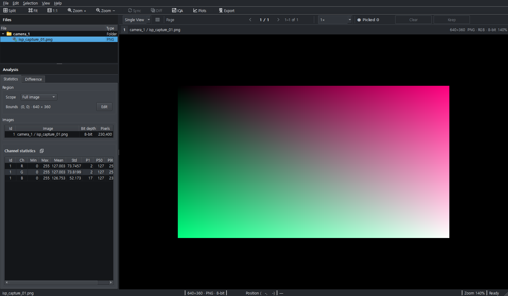
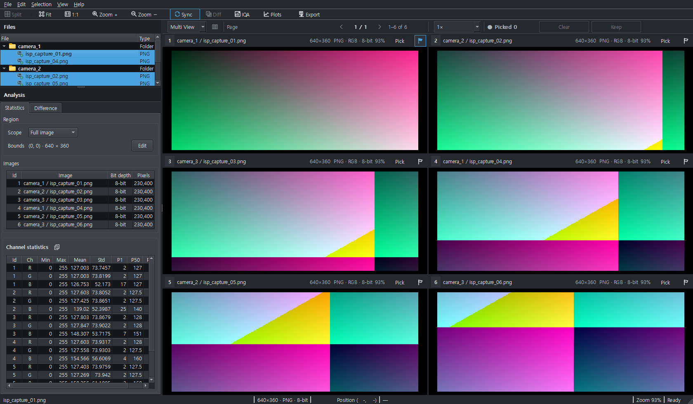
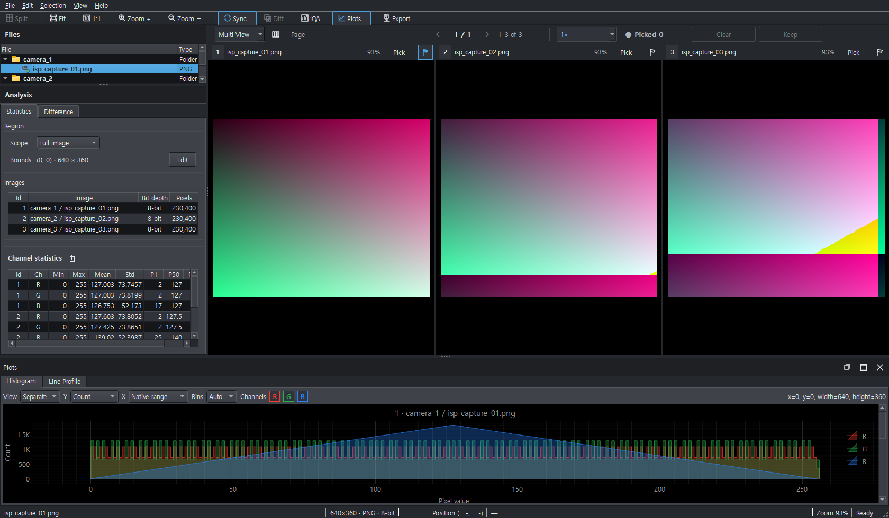
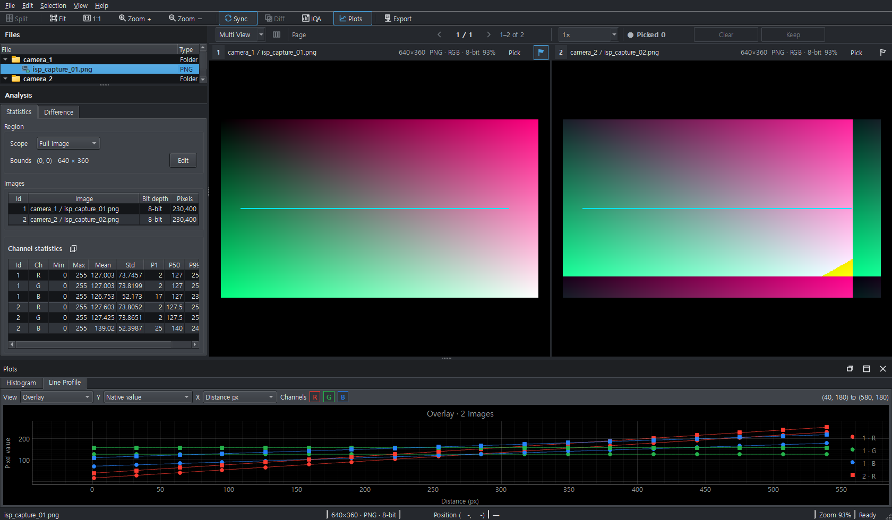
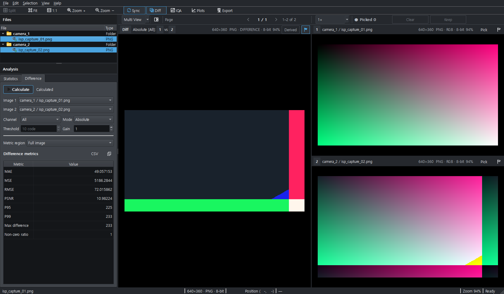
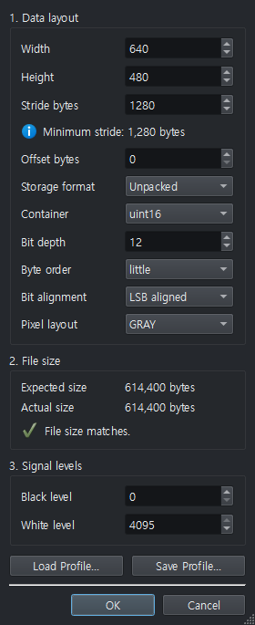

# Screenshot Strategy

This directory contains only screenshots captured from the real PixelScope application and already present in the repository. Do not create mock UI screenshots to fill missing coverage.

## Reused captures

- `single-image.png` — main Image View / single-image state.
- `six-image-multiview.png` — six-slot Multi View.
- `histogram-docked.png` — Histogram workspace.
- `line-profile-docked.png` — Line Profile workspace.
- `difference-analysis.png` — Difference analysis.
- `plots-floating.png` — floating Plots workspace.
- `raw-profile-dialog.png` — RAW profile dialog.

## Captures still needed

The following remain missing; before WP-Help-E automation is proven, they still require reviewed, release-representative real-application captures. WP-Help-E intends to automate scene construction and replace manual capture as the normal workflow:

- Main window overview with workspace labels visible.
- Files workspace focused on registration/selection.
- ROI creation and exact X/Y/Width/Height entry.
- Statistics workspace.
- Settings dialog.
- IQA workspace in a deployment-neutral state.
- Native YUV interpretation dialog if the current UI can be shown without deployment-specific data.

When a new screenshot is added, record the application version/commit in the pull request that adds it and verify that labels/actions still match the current guide. Avoid screenshots containing private paths, company-internal data, credentials, hostnames, or user-identifying content.

## Current examples

## Automated lifecycle: E1 verified / E2 manifest foundation

The [WP-Help-E execution plan](../../../exec-plans/active/wp-help-e-automated-screenshot-lifecycle.md)
documents the proposed manifest, real-QWidget scene registry, Windows hosted capture
feasibility gate, main/PR visual comparisons, conditional Markdown insertion, and
human-reviewed promotion. The current seven PNGs are real application captures, but
their exact capture commits and runtime environment are not established; do not
invent provenance. The existing `scripts/capture_ui_review.py` generates ten
snake_case filenames that do not match the seven committed hyphenated names.

E1 proved hosted Windows capture for real Single View and RAW Dialog in separate processes (PR #94), not the other manual scenarios. E2's versioned [Screenshot Manifest](manifest.json) records seven checked-in legacy PNGs, the seven outstanding coverage gaps, capture ownership and three non-guide diagnostic outputs. It retains unknown legacy capture SHA rather than inventing provenance. It is a static validation/inventory contract only: E3 impact selection, E4 baseline/HEAD visual diff, E5 missing-image omission and E6 reviewed promotion are **not available yet**. A PR-produced
candidate is never an approved User Guide image until its content and provenance have
been checked and the PNG plus manifest changes have been committed through review.

## Manifest schema: provenance versus future targets

`target_capture_profile` names the **intended** Windows rendering profile for newly captured candidates. It is not the capture environment, app version, original SHA, or a comparable E4 baseline for any existing `legacy-unverified` PNG, nor proof that a planned scenario exists. E4 must compare actual per-capture rendering fingerprints and scenario contracts for both pinned base and head; E6 must separately approve candidate bytes and their observed capture source.

`capture_mode: planned` has no registered real-UI builder. After a real isolated builder is implemented and validated, a *new* scene can transition to `capture_mode: isolated`, `placement: required`, and `status: capture-ready` **without `legacy_output`**. That status reserves an insertion marker but does not authorize committing an unapproved PNG. `legacy_output` is required only for genuinely historical/manual assets and must match the exact old script scene output. Existing guide PNGs retain `legacy-unverified` unless approved through E6. The three diagnostics are disjoint from guide-owned manual output names.

The E2 PNG validator intentionally accepts only verified non-interlaced 8-bit RGB/RGBA encodings, checking CRC, bounded IDAT decompression, scanline length and filters. Indexed/Adam7/other formats are rejected **even if otherwise legal PNG** until supported by an explicit decoder contract and regression tests. This is a conservative documentation-image format gate, not a general-purpose PNG decoder.

## Owner-observed current-UI screenshot staleness

On 2026-09-24 the owner confirmed live Help opens and images render, but some existing screenshots appear outdated relative to the running application. Exact pages are not yet established; treat **all seven legacy-unverified images** as requiring a scene-by-scene current-UI review before E6 closeout. E3's selector does not replace pixels. E4/E5/E6 must capture real PixelScope UI, inspect image labels/layout/privacy, preserve the existing six linked topic images during transition, and only commit owner-approved replacements with actual provenance. Do not infer that the Markdown instructions themselves are wrong without a separate finding.
